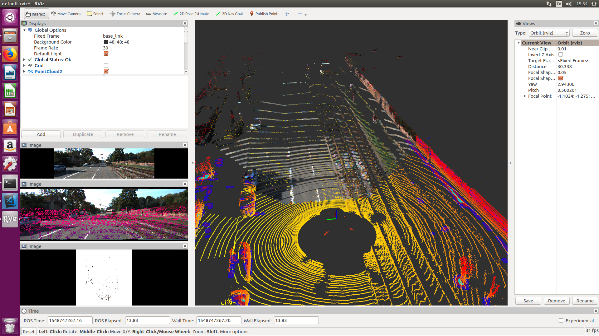

#### ROS_Raw_Kitti_Player;

Ros Package to access  manipulate and process Raw KITTI dataset. In this Project there is sensor fusion, and some other perception is done. Once it is complete I will release project Manual. In current phase , once you execute this Project you should see something similiar to below picture.

## Installing ROS

  Accept software from packages.ros.org. 

 > sudo sh -c 'echo "deb http://packages.ros.org/ros/ubuntu $(lsb_release -sc) main" > /etc/apt/sources.list.d/ros-latest.list'

Set up keys

 > sudo apt-key adv --keyserver hkp://ha.pool.sks-keyservers.net:80 --recv-key 421C365BD9FF1F717815A3895523BAEEB01FA116
 
Debian  up-to-date: 
 > sudo apt-get update

Install full ROS version: 
 > sudo apt-get install ros-kinetic-desktop-full

You will need to initialize rosdep:
 > sudo rosdep init

 > rosdep update
 
It's convenient if the ROS environment variables are automatically added to your bash session every time a new shell is launched: 
 > echo "source /opt/ros/kinetic/setup.bash" >> ~/.bashrc
 > source ~/.bashrc

 ## Clone and Build This Repository

 > cd catkin_ws/src

 > git clone https://github.com/jediofgever/ROS_Raw_Kitti_Player.git

 > cd .. && catkin_make 

 ## Reconfigure KITTI data Path in launch file 

 under this directory 'ROS_Raw_Kitti_Player/kitti_ros/launch',  find 'kitti_ros_node.launch' file,
 change the data paths according to your own envoirmment. For example my base directory for KITTI data is as follow ; 

 > /home/atas/kitti_data/2011_09_26/2011_09_26_drive_0001_sync/

 basically once you need to change username with yours , it should be fine afterwards.

 ## Execute Kitti_ros node

 > cd catkin_ws

 > source devel/setup.bash 

 > roslaunch kitti_ros kitti_ros_node.launch

 Now RVIZ should open and you should be able to see something similar to above picture

## Referencees

A Special Thanks to [Simon](https://github.com/appinho) for letting me to use his helper package which saved me bunch of time. 
Checkout his awesome ROS Perception project [here](https://github.com/appinho/SARosPerceptionKitti)

 

#### TODO;
Complete Documentation
