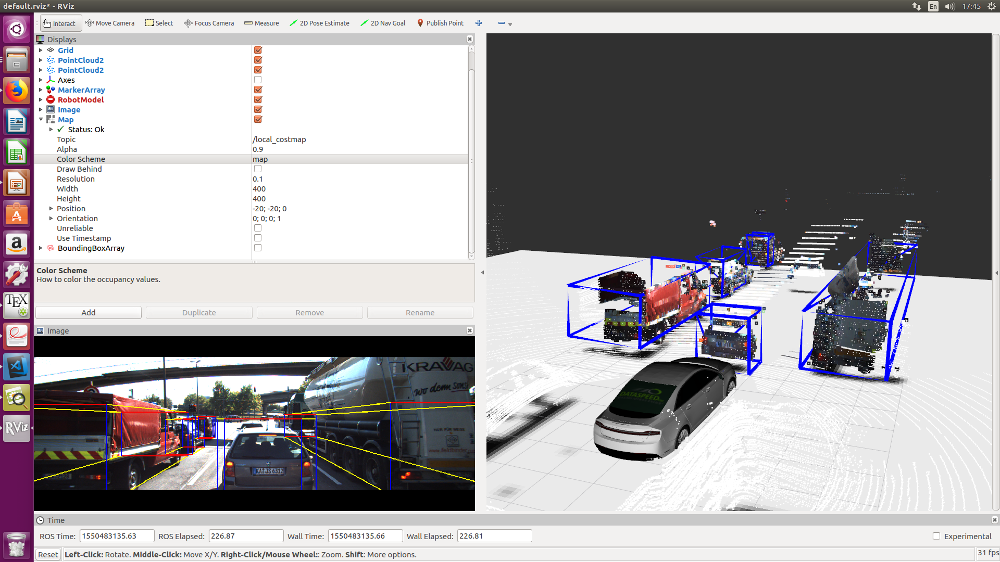

#### ROS_Raw_Kitti_Player;

Ros Package to access  manipulate and process Raw KITTI dataset. In this Project there is sensor fusion, and some other perception is done. Once it is complete I will release project Manual. In current phase , once you execute this Project you should see something similiar to below picture.

Latest Commit; 

Initial Version 

## Installing ROS

  Accept software from packages.ros.org. 

 > sudo sh -c 'echo "deb http://packages.ros.org/ros/ubuntu $(lsb_release -sc) main" > /etc/apt/sources.list.d/ros-latest.list'

Set up keys

 > sudo apt-key adv --keyserver hkp://ha.pool.sks-keyservers.net:80 --recv-key 421C365BD9FF1F717815A3895523BAEEB01FA116
 
Debian  up-to-date: 
 > sudo apt-get update

Install full ROS version: 
 > sudo apt-get install ros-kinetic-desktop-full

You will need to initialize rosdep:
 > sudo rosdep init

 > rosdep update
 
It's convenient if the ROS environment variables are automatically added to your bash session every time a new shell is launched: 
 > echo "source /opt/ros/kinetic/setup.bash" >> ~/.bashrc
 > source ~/.bashrc

 ## Clone and Build This Repository

 > cd catkin_ws/src

 > git clone https://github.com/jediofgever/ROS_Raw_Kitti_Player.git

 > cd ROS_Raw_Kitti_Player

 > git submodule update --init --recursive

 > cd .. && catkin_make 
 
 ## Getting Instance Segmented Images of KITTI 
 
 **for the testing without installing maskrcnn and other dependencies;**
 , I provide obtained masks for scenario; `2011_09_26_drive_0001_sync` and `2011_09_26_drive_0052_sync` ,download the provided files [0001](https://drive.google.com/file/d/1f6hxpFloVp8Gwn6qe6GjmKyY15Le5E0j/view), put the `maskrcnn_detections` folder under `2011_09_26_drive_0001_sync/` and this should be all 
 for `0052` [here](https://drive.google.com/open?id=1aWIw4FHLvf8fbpLeF_E7K6RA38mHHqCS)

**for a quick start using maskrcnn;**
1.  [maskrcnn that I used](https://github.com/facebookresearch/maskrcnn-benchmark)  bases on Pytorch, and some other helper libs. A complete guide to install maskrcnn and requirements can be found [here](https://github.com/facebookresearch/maskrcnn-benchmark/blob/master/INSTALL.md)
2. after you have maskrcnn on your system , download raw kitti images of the scenario that you would like to test. Maskrcnn provides a script to infer masks on rgb images under demo directory. I have modified that script to obtain masks in automated fashion, [here](https://gist.github.com/jediofgever/12bcab2b6389208c6ecab248bdab1c19) is the modified script(the paths to kitti images should be changed to according to your system path)
3. the obtained masks should be on a white background, so that when we project lidar point clouds  onto this image we can differantiate objects and non-objects. to write masks on a white background ; under `demo`   directory of maskrcnn,` predictor.py ` should be modified as [this one](https://gist.github.com/jediofgever/0e0e0db7eb833ecce51405306662c53b) (very small change)

 ## Reconfigure KITTI data Path in launch file 
 

 under this directory 'ROS_Raw_Kitti_Player/kitti_ros/launch',  find 'kitti_ros_node.launch' file,
 change the data paths according to your own envoirmment. For example my base directory for KITTI data is as follow ; 

An example scenario that you can download here ; https://drive.google.com/open?id=1aWIw4FHLvf8fbpLeF_E7K6RA38mHHqCS
download this kitti sequence(0052) and place it under your directory, it should look somethinglike this

 > /home/atas/kitti_data/2011_09_26/2011_09_26_drive_0052_sync/

 basically once you need to change username with yours , it should be fine afterwards.

 ## Execute Kitti_ros node

 > cd catkin_ws

 > source devel/setup.bash 

 > roslaunch kitti_ros kitti_ros_node.launch

 Now RVIZ should open and you should be able to see something similar to above picture

## Referencees

A Special Thanks to [Simon](https://github.com/appinho) for letting me to use his helper package which saved me bunch of time. 
Checkout his awesome ROS Perception project [here](https://github.com/appinho/SARosPerceptionKitti)

 

#### TODO;
Complete Documentation
